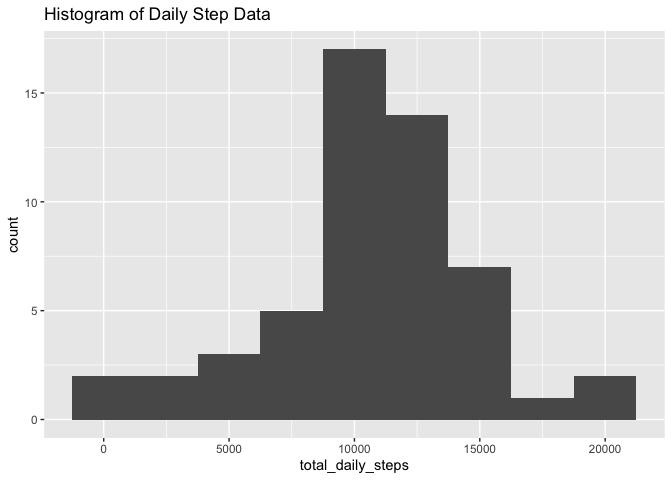
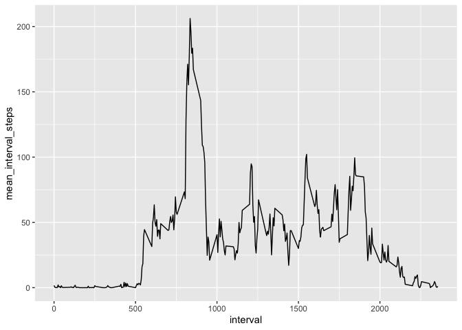
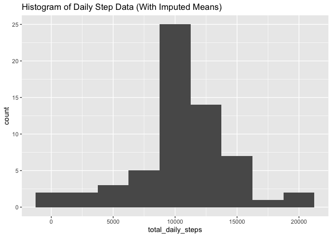
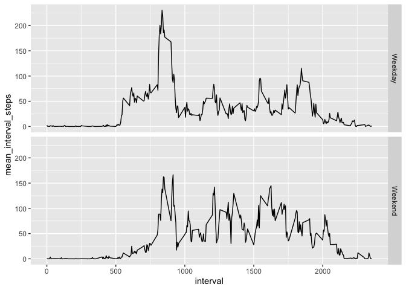

## Dependencies 

```r
library(tidyverse)
```

```
## ── Attaching packages ─────────────────────────────────────────────────────────────────────────────────────── tidyverse 1.3.0 ──
```

```
## ✓ ggplot2 3.3.2     ✓ purrr   0.3.4
## ✓ tibble  3.0.3     ✓ dplyr   1.0.2
## ✓ tidyr   1.1.2     ✓ stringr 1.4.0
## ✓ readr   1.3.1     ✓ forcats 0.5.0
```

```
## Warning: package 'readr' was built under R version 3.4.4
```

```
## Warning: package 'stringr' was built under R version 3.4.4
```

```
## ── Conflicts ────────────────────────────────────────────────────────────────────────────────────────── tidyverse_conflicts() ──
## x dplyr::filter() masks stats::filter()
## x dplyr::lag()    masks stats::lag()
```
## Loading and preprocessing the data
- Unzip the activity file if it is there.
- Load the data file into a data frame called `activity`


```r
unzip("activity.zip")
activity <- read_csv("activity.csv")
```

```
## Parsed with column specification:
## cols(
##   steps = col_double(),
##   date = col_date(format = ""),
##   interval = col_double()
## )
```
### Total Daily Steps 

```r
daily_steps <- activity %>% 
    drop_na() %>%
    select(date, steps) %>% 
    group_by(date) %>%
    summarize(total_daily_steps = sum(steps, na.rm=TRUE), .groups = 'drop')
head(daily_steps)
```

```
## # A tibble: 6 x 2
##   date       total_daily_steps
##   <date>                 <dbl>
## 1 2012-10-02               126
## 2 2012-10-03             11352
## 3 2012-10-04             12116
## 4 2012-10-05             13294
## 5 2012-10-06             15420
## 6 2012-10-07             11015
```
### Mean Steps by Interval

```r
interval_steps <- activity %>% 
    drop_na() %>%
    select(interval, steps) %>% 
    group_by(interval) %>%
    summarize(mean_interval_steps = mean(steps, na.rm=TRUE), .groups = 'drop')
head(interval_steps)
```

```
## # A tibble: 6 x 2
##   interval mean_interval_steps
##      <dbl>               <dbl>
## 1        0              1.72  
## 2        5              0.340 
## 3       10              0.132 
## 4       15              0.151 
## 5       20              0.0755
## 6       25              2.09
```

## What is mean total number of steps taken per day?
For this part of the assignment, you can ignore the missing values in the dataset.

1. Make a histogram of the total number of steps taken each day
2. Calculate and report the mean and median total number of steps taken per day

### Histogram of total number of steps taken per day


```r
g <- ggplot(daily_steps, aes(total_daily_steps))
g + geom_histogram(binwidth=2500) + ggtitle("Histogram of Daily Step Data")
```

<!-- -->

### Mean

```r
daily_steps <- activity %>% 
    drop_na() %>%
    select(date, steps) %>% 
    group_by(date) %>%
    summarize(total_daily_steps = sum(steps, na.rm=TRUE), .groups = 'drop')
mean_total_steps_per_day <- mean(daily_steps$total_daily_steps, na.rm=TRUE)
mean_total_steps_per_day
```

```
## [1] 10766.19
```
The mean total number of steps per day in the data set is `10766.19` steps.

### Median

```r
daily_steps <- activity %>% 
    drop_na() %>%
    select(date, steps) %>% 
    group_by(date) %>%
    summarize(total_daily_steps = sum(steps, na.rm=TRUE), .groups = 'drop')
median_total_steps_per_day <- median(daily_steps$total_daily_steps, na.rm=TRUE)
median_total_steps_per_day
```

```
## [1] 10765
```
The median total number of steps per day in the data set is `10765.00` steps.

## What is the average daily activity pattern?

1. Make a time series plot (i.e. `type = "l"`) of the 5-minute interval (x-axis) and the average number of steps taken, averaged across all days (y-axis)

```r
g <- ggplot(interval_steps, aes(interval, mean_interval_steps))
g + geom_line()
```

<!-- -->

2. Which 5-minute interval, on average across all the days in the dataset, contains the maximum number of steps?

```r
max_interval = interval_steps %>% filter(mean_interval_steps == max(interval_steps$mean_interval_steps))
max_interval$interval
```

```
## [1] 835
```
The interval with the maximum number of steps is `835`.

## Imputing missing values
Note that there are a number of days/intervals where there are missing values (coded as NA). The presence of missing days may introduce bias into some calculations or summaries of the data.

1. Calculate and report the total number of missing values in the dataset (i.e. the total number of rows with NAs)
2. Devise a strategy for filling in all of the missing values in the dataset. The strategy does not need to be sophisticated. For example, you could use the mean/median for that day, or the mean for that 5-minute interval, etc.
3. Create a new dataset that is equal to the original dataset but with the missing data filled in.
4. Make a histogram of the total number of steps taken each day and Calculate and report the mean and median total number of steps taken per day. Do these values differ from the estimates from the first part of the assignment? What is the impact of imputing missing data on the estimates of the total daily number of steps?

### Missing Values Reporting
> Calculate and report the total number of missing values in the dataset (i.e. the total number of rows with NAs)


```r
na_rows <- activity %>% filter(is.na(steps))
count(na_rows)
```

```
## # A tibble: 1 x 1
##       n
##   <int>
## 1  2304
```
The number of rows with NA steps is `2304`.

### Imputing Data
> Devise a strategy for filling in all of the missing values in the dataset. The strategy does not need to be sophisticated. For example, you could use the mean/median for that day, or the mean for that 5-minute interval, etc.

I'll use the mean for the interval from the total dataset.

### New Dataset With Imputed
> Create a new dataset that is equal to the original dataset but with the missing data filled in.


```r
imputed_activity <- activity %>% 
  left_join(interval_steps, by="interval") %>% 
  mutate(steps = coalesce(steps, mean_interval_steps))
head(imputed_activity)
```

```
## # A tibble: 6 x 4
##    steps date       interval mean_interval_steps
##    <dbl> <date>        <dbl>               <dbl>
## 1 1.72   2012-10-01        0              1.72  
## 2 0.340  2012-10-01        5              0.340 
## 3 0.132  2012-10-01       10              0.132 
## 4 0.151  2012-10-01       15              0.151 
## 5 0.0755 2012-10-01       20              0.0755
## 6 2.09   2012-10-01       25              2.09
```
#### Imputed Mean Total Steps

```r
imputed_daily_steps <- imputed_activity %>% 
    drop_na() %>%
    select(date, steps) %>% 
    group_by(date) %>%
    summarize(total_daily_steps = sum(steps, na.rm=TRUE), .groups = 'drop')
head(imputed_daily_steps)
```

```
## # A tibble: 6 x 2
##   date       total_daily_steps
##   <date>                 <dbl>
## 1 2012-10-01            10766.
## 2 2012-10-02              126 
## 3 2012-10-03            11352 
## 4 2012-10-04            12116 
## 5 2012-10-05            13294 
## 6 2012-10-06            15420
```
#### Imputed Mean Steps by Interval

```r
imputed_interval_steps <- imputed_activity %>% 
    drop_na() %>%
    select(interval, steps) %>% 
    group_by(interval) %>%
    summarize(mean_interval_steps = mean(steps, na.rm=TRUE), .groups = 'drop')
head(imputed_interval_steps)
```

```
## # A tibble: 6 x 2
##   interval mean_interval_steps
##      <dbl>               <dbl>
## 1        0              1.72  
## 2        5              0.340 
## 3       10              0.132 
## 4       15              0.151 
## 5       20              0.0755
## 6       25              2.09
```

### Histogram
> Make a histogram of the total number of steps taken each day and Calculate and report the mean and median total number of steps taken per day. Do these values differ from the estimates from the first part of the assignment? What is the impact of imputing missing data on the estimates of the total daily number of steps?


```r
g <- ggplot(imputed_daily_steps, aes(total_daily_steps))
g + geom_histogram(binwidth=2500) + ggtitle("Histogram of Daily Step Data (With Imputed Means)")
```

<!-- -->
#### Mean Daily Steps (Imputed)

```r
imputed_daily_steps <- imputed_activity %>% 
    drop_na() %>%
    select(date, steps) %>% 
    group_by(date) %>%
    summarize(total_daily_steps = sum(steps, na.rm=TRUE), .groups = 'drop')
mean_total_steps_per_day <- mean(imputed_daily_steps$total_daily_steps, na.rm=TRUE)
mean_total_steps_per_day
```

```
## [1] 10766.19
```
From the imputed data set the mean total number of steps per day in the data set is `10766.19` steps.

### Median Daily Steps (Imputed)

```r
imputed_daily_steps <- imputed_activity %>% 
    drop_na() %>%
    select(date, steps) %>% 
    group_by(date) %>%
    summarize(total_daily_steps = sum(steps, na.rm=TRUE), .groups = 'drop')
median_total_steps_per_day <- median(imputed_daily_steps$total_daily_steps, na.rm=TRUE)
median_total_steps_per_day
```

```
## [1] 10766.19
```
From the imputed data set the median total number of steps per day in the data set is `10766.19` steps.

## Are there differences in activity patterns between weekdays and weekends?

For this part the weekdays() function may be of some help here. Use the dataset with the filled-in missing values for this part.

1. Create a new factor variable in the dataset with two levels -- "weekday" and "weekend" indicating whether a given date is a weekday or weekend day.

```r
imputed_activity <- imputed_activity %>% mutate(part_of_week = case_when(
      weekdays(date) == "Sunday"   ~ "Weekend",
      weekdays(date) == "Saturday" ~ "Weekend",
      TRUE                         ~ "Weekday")
)
imputed_activity <- imputed_activity %>% mutate(part_of_week = factor(part_of_week))
head(imputed_activity)
```

```
## # A tibble: 6 x 5
##    steps date       interval mean_interval_steps part_of_week
##    <dbl> <date>        <dbl>               <dbl> <fct>       
## 1 1.72   2012-10-01        0              1.72   Weekday     
## 2 0.340  2012-10-01        5              0.340  Weekday     
## 3 0.132  2012-10-01       10              0.132  Weekday     
## 4 0.151  2012-10-01       15              0.151  Weekday     
## 5 0.0755 2012-10-01       20              0.0755 Weekday     
## 6 2.09   2012-10-01       25              2.09   Weekday
```
2. Make a panel plot containing a time series plot (i.e. type = "l") of the 5-minute interval (x-axis) and the average number of steps taken, averaged across all weekday days or weekend days (y-axis). The plot should look something like the following, which was created using simulated data:

Create a data frame with mean number of steps per interval using imputed activity.


```r
imputed_interval_steps <- imputed_activity %>% 
    drop_na() %>%
    select(interval, steps, part_of_week) %>% 
    group_by(interval, part_of_week) %>%
    summarize(mean_interval_steps = mean(steps, na.rm=TRUE), .groups = 'drop')
head(imputed_interval_steps)
```

```
## # A tibble: 6 x 3
##   interval part_of_week mean_interval_steps
##      <dbl> <fct>                      <dbl>
## 1        0 Weekday                   2.25  
## 2        0 Weekend                   0.215 
## 3        5 Weekday                   0.445 
## 4        5 Weekend                   0.0425
## 5       10 Weekday                   0.173 
## 6       10 Weekend                   0.0165
```

Plot a panel comparing weekdays to weekends.

```r
g <- ggplot(imputed_interval_steps, aes(interval, mean_interval_steps))
g + facet_grid(rows=vars(part_of_week)) + geom_line() 
```

<!-- -->

